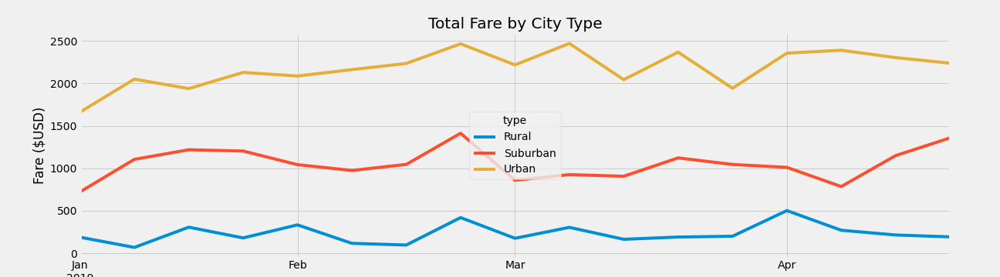

# PyBer_Analysis

## Overview
The purpose of our analysis was to perform an exploratory analysis where we would create several types of visualizations. To show the relationship between the city and the type of drivers, as well as, the percentage total fares, riders, drivers by type of city. The analysis and visualizations that would be produced are intended to help Pyber improve access to ridesharing services and determine affordability for under-served neighborhoods.

## Results

In the analysis we were comparing three different types of cities: urban, suburban, and rural. We were focused on comparing the amount rides in each type of city, amount of fares, the average cost of a fare per ride and driver, and total fare by city type. All of this ride-sharing data from PyBer would help us develop some insight and ideas on how to make ridesharing services more affordable in under-served neighborhoods.

* The data shows there is a significantly lager amount of riders in urban cities
* Throughout Jan 2019 to May 2019, there was a total of 1,625 rides complteted in urban cities, 625 in suburban cities, and 125 in rural cities.

* Similar to the figure above, urban cities contributed the most in total fares throughout the five month period being analyzed.
* Urban cities yielded $39,854.38, suburban cities $19,356, and rural cities $4,327.93.

* The greatest percentage difference that exists between these three figures, is the amount of drivers in each city type
* Urban cities account for a little bit over 80% of the total drivers working throughout January 2019 to May 2019

* This figure shows that greater demand influences the cost per fare to decrease, as well as, the average fare per driver.
* Riders in rural cities have to pay about $10 more compared to urban cities, probably impacting the amount of riders that exist in rural areas.
* However, drivers in rural cities can technically make more money per ride but probably have less jobs due to less demand.

* The following line plot shows The drastic opposition of total fare in each city type throughout the five months.
* Showing how urban cities made between $1600-$2450, and rural cities earned between $60-$500.

